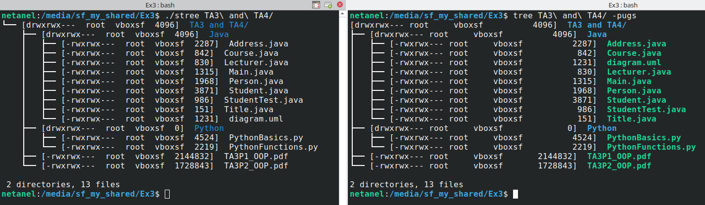

# Advanced Programming - Exercise 3

In this exercise we've implemented as a small C program, **stree**, which visualizes a directory tree in a user-friendly manner. It is designed to emulate the Unix tree command with a specific set of flags.

The `stree` program simulates the `tree` command with the `-pugs` flags:
- `-p` prints the file type and permissions for the file (like `ls -l`).
- `-u` prints the username or the UID of the owner of the file.
- `-g` prints the group name or the GID of the owner of the file.
- `-s` prints the size in bytes of each file.

## Getting Started

These instructions will get you a copy of the project up and running on your local machine for development and testing purposes.

### Prerequisites

To run the program, you need a Linux-based environment with GCC and `make` installed.

### Installation

Clone the repository using the following command:

```bash
git clone https://github.com/netanellevine/advanced_programming.git
```

Navigate to the Ex3 directory:

```bash
cd advanced_programming/Ex3
```

### Compilation

Compile the `stree` program using the following command:

```bash
make
```

Or

```bash
make all
```

### Usage

To run the program, you need to pass the directory you want to visualize as an argument. For example, if you want to visualize the current directory, you can run:

```bash
./stree .
```

Here's an example of the output:


